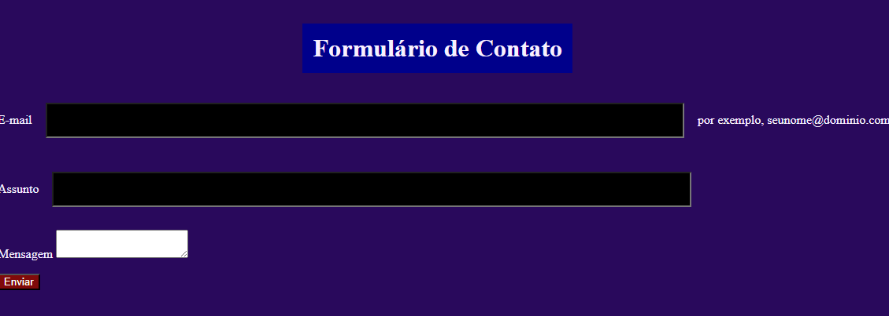

## Form-Contato 📞

# Descrição do projeto
Este é um repositório no GitHub que apresenta um projeto prático de um formulário de contato desenvolvido com HTML e CSS. O objetivo deste projeto é fornecer um exemplo de implementação de um formulário interativo e estilizado, demonstrando como criar campos de entrada, botões e elementos de seleção. Aprenda como melhorar e usabilidade e o design dos formulários em suas páginas web.

<h1 align = "center">

Elementos e Atributos Utilizados

</h1>

>* ``Button``
>É um elemento interativo ativado por um usuário com mouse, teclado, dedo, comando de voz ou outra tecnologia assistiva. Uma vez ativado, ele executa uma ação, como enviar um formulário ou abrir uma caixa de diálogo.

>* ``Img``
>incorpora uma imagem no documento.

>* ``Label``
>Representa uma legenda para um item em uma interface do usuário.

>* ``Button``
>representa o conteúdo de um documento HTML.

>* ``Input``
>É usado para criar controles interativos para formulários baseados na Web, a fim de aceitar dados do usuário.

>

##  🛠️Funcionalidades
>- Coleta de informações do remetente, como nome, endereço de e-mail e telefone.
>- Campo para o usuário inserir uma mensagem ou solicitação específica.
>- Validação dos dados inseridos para garantir que sejam fornecidos corretamente.
>- Notificação por e-mail ou armazenamento em um banco de dados para acompanhar as mensagens recebidas.

 ## Como utilizar
>1. Clone ou baixe este repositório em seu ambiente local.
>2. Abra o arquivo "form-contato" em seu navegador web.
>3. Preencha os campos do formulário com suas informações de contato e a mensagem que deseja enviar.
>4. Clique no botão "Enviar" para enviar a mensagem.
>5. A mensagem será processada e encaminhada para o destinatário designado.

# Tecnologias Utilizadas
>* ``HTML5``
>* ``CSS3``
>* ``Github`` 
>* ``Git``
>* ``Vscode``

# Fontes consultadas
* [Developer](https://developer.mozilla.org/en-US/docs/Web/HTML/Element/input)

